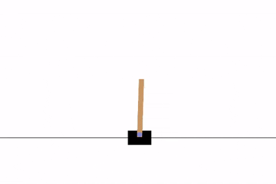

# Numpy RL Engine
<p align="center">

</p>
A modular Deep Reinforcement Learning framework implemented entirely in NumPy. This project provides a transparent, low-level implementation of core deep learning concepts including backpropagation, optimization algorithms, and reinforcement learning agents, without reliance on automatic differentiation libraries like PyTorch or TensorFlow.

## Overview

The primary objective of this library is to demonstrate the mathematical foundations of deep learning and reinforcement learning. It features a custom-built automatic differentiation engine and manual implementations of standard components such as the Adam optimizer, fully connected layers, and the Deep Q-Network (DQN) algorithm.

## Key Features

  * **Neural Network primitives:** Custom implementation of dense layers, activation functions (ReLU, Tanh, Softmax), and loss functions (MSE, CrossEntropy).
  * **Manual Backpropagation:** Gradients are computed via the chain rule, offering a clear view of the backward pass mechanics.
  * **Optimization:** Hand-coded **Adam Optimizer** incorporating momentum and adaptive learning rates.
  * **Reinforcement Learning:** A modular **DQN (Deep Q-Network)** agent featuring:
      * Experience Replay Buffer for sample efficiency.
      * Target Networks to stabilize training.
      * Epsilon-Greedy exploration strategies.
  * **Environment Integration:** Interfaces with OpenAI Gymnasium environments (e.g., `CartPole-v1`) using custom wrappers for reward shaping.

## Installation

Clone the repository and install the required dependencies:

```bash
git clone https://github.com/etekmen13/numpy-rl-engine.git
cd numpy-rl-engine
pip install -r requirements.txt
```

## Usage

### Training

To train the DQN agent on the `CartPole-v1` environment, execute the following command:

```bash
python main.py --mode train --env CartPole-v1
```

Training progress (reward and steps per episode) will be logged to the console. Upon completion, model weights are saved to `dqn_weights.npz`.

### Evaluation

To evaluate a trained model and generate a rendering of the agent's performance:

```bash
python main.py --mode eval --load
```

This command loads the saved weights, runs an evaluation episode, and saves the resulting video to the `./videos/` directory.

## Project Structure

  * **`neuralnet/`**: Core deep learning framework.
      * `layers.py`: Implementation of fully connected layers and manual backward passes.
      * `activations.py`: Activation functions (ReLU, Tanh, Sigmoid, Softmax).
      * `losses.py`: Loss functions (MSE, CrossEntropy).
      * `optimizers.py`: Optimization algorithms (Adam).
  * **`reinforcement/`**: Reinforcement learning algorithms and utilities.
      * `models.py`: DQN Agent logic and network initialization.
      * `replay.py`: Experience Replay Buffer implementation.
      * `envs/`: Custom environment wrappers.
  * **`metrics/`**: Visualization and logging tools.
  * **`main.py`**: Command-line interface for training and evaluation.

## Motivation

This library was developed to provide a granular understanding of the mechanics underlying modern deep learning frameworks. By implementing components such as the computational graph and momentum-based optimizers from first principles, this project isolates and exposes the challenges of training unstable systems—specifically the non-stationary targets and correlation issues inherent in Q-learning.
